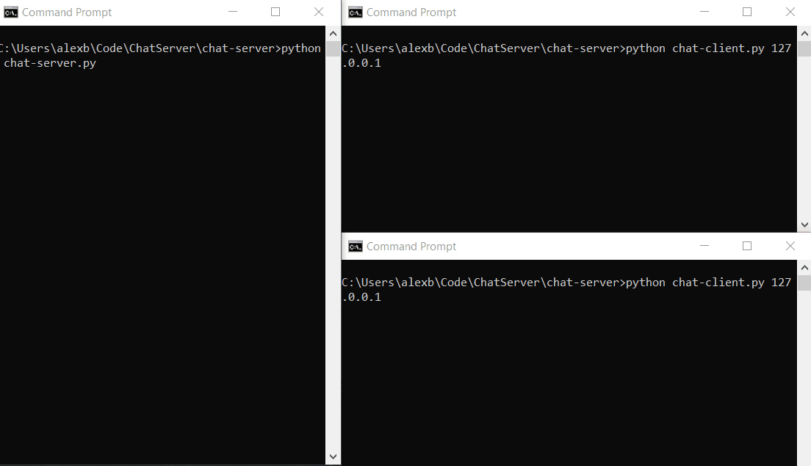

# Chat server
A chat server and client written in python using the socket library.

There are two sets of clients and servers: echo and chat.

## Demo


## Installation and Usage
To run the fully functioning chat application, in one CLI run from the root directory:

```bash
python chat-server.py
```

Then in one or more others, from the same directory:

```bash
python chat-client.py
```

## License
[MIT](https://choosealicense.com/licenses/mit/)
